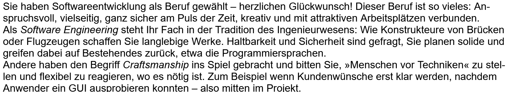
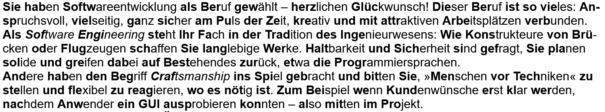

# Bionic Reading EPUB Converter

This web application allows you to convert an EPUB file to a Bionic Reading EPUB file. The app processes the text within the EPUB to enhance the reading experience by applying Bionic Reading principles.

## Example

The following sample text of how Bionic Reading enhances the reading experience is from the book "Handbuch für Softwareentwickler" by Veikko Krypczyk and Olena Bochkor, published by Rheinwerk Verlag. The text is in German and is used for demonstration purposes only.

#### Without Bionic Reading

#### With Bionic Reading

## Key Features

- **EPUB to Bionic Reading Conversion**: Upload your EPUB file, and the app will process the text to add Bionic Reading enhancements.
- **User Privacy**: All processing is done locally on your device. Your EPUB file never leaves your computer, ensuring your privacy and data security.
- **Ease of Use**: Simple and intuitive interface to upload your file and download the converted version.

## Important Notes

1. **Keep the Original File**: Always keep a copy of your original EPUB file. While the conversion process aims to maintain the integrity of your file, there is no guarantee of success for every EPUB file due to variations in formatting and structure.
2. **No Success Guarantee**: The app does its best to convert your file accurately, but due to the diverse nature of EPUB files, some may not convert perfectly or at all.
3. **Local Processing**: All file processing happens on your computer, which means your data is not uploaded to any server. This enhances privacy but also means that the app's performance depends on your device's capabilities.

## Getting Started

To use the application, visit the [Bionic Reading EPUB Converter GitHub Pages site](https://pxammaxp.github.io/bionic-reading-epub-converter-webapp/).

## Usage

1. **Upload an EPUB file**: Click the upload button and select an EPUB file from your computer.
2. **Processing**: The app will process the EPUB file and apply Bionic Reading enhancements to the text.
3. **Download the Converted File**: Once processing is complete, download the converted EPUB file to your computer.

## Author

- **M. Passarello**

## Repository

For more information, visit the [GitHub repository](https://github.com/PxaMMaxP/bionic-reading-epub-converter-webapp).
